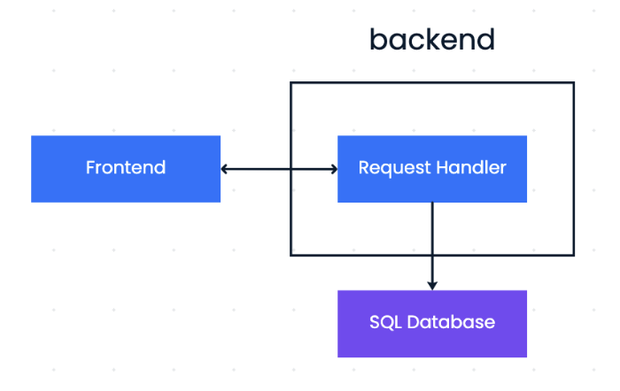

# What is a FlavorBook?
**FlavorBook** is a collaborative recipe book web application where users can:
- 📚 **Create and manage recipe books**
- ✍️ **Add, edit, and view recipes** with markdown and image uploading support
- 👥 **Invite others** as co-editors or read-only viewers to collaborate on books
- 🔐 **Access control**: ensures safety of recipe books
  - **Owners** can edit everything and invite others
  - **Co-editors** can edit recipes but not manage access
  - **Read-only visitors** can view content only
- 📝 **Auto-save** and live recipe editing with support for images and categories
- 🔁 Seamlessly **navigate** between recipe lists and individual recipe pages


# Technical Architecture


# Developers
- **Dili Wu:** Worked on frontend architecture and integration.
- **Zory Zhang:** Designed UI and implemented image uploading.
- **Mingqian Wang:**: Worked on database and implemented core backend functions.
- **Ruoyi Wu:** Worked on invitation function and maintained backend security.

# Environment set up
## Set up backend
```
cd src/app/backend
npm install express mysql dotenv nodemon cors bcrypt jsonwebtoken
```
## Set up frontend using Next.js
> "Next.js is a React framework for building full-stack web applications. You use React Components to build user interfaces, and Next.js for additional features and optimizations."
```bash
curl -o- https://raw.githubusercontent.com/nvm-sh/nvm/v0.39.4/install.sh | bash
#restart terminal
nvm install 22 && nvm use 22
npm install -g npm@latest
npm install
```
# Development
## Run backend
```
cd src/app/backend
npm run dev
```
If the backend is working, it will return a page saying "Backend is working!"

## Run frontend
Run `npm run dev` to start the development server.
Visit http://localhost:3000 to view your application.
The page auto-updates as you edit the file.

# Instructions to use Flavorbook
- If you want to run it locally, follow the instructions above.
- Or you can visit [FlavorBook](https://flavorbook.vercel.app/) to see our app!

# For devlopment purpose only
## Backend Objects
- user
    - user_id
    - username
    - pwd
    - owner_of: list of recipe book id
    - read_only_access_to: list of recipe book id (people who can coedit will not in this list)
    - coedit_access_to: list of recipe book id (mutually exclusive with read_only_access_to)
- recipe book
    - book_id
    - book_name (might contain whitespace, emoji, etc.)
    - recipe_list
    - owner_name (str): owner username
    - relationships_display: a string that display all users with ownership, read only access, and coedit access (with brakets displaying relationships).
- recipe
    - recipe_id
    - recipe_name (might contain whitespace, emoji, etc.)
    - recipe_category (appetizer, main course, dessert, etc.)
    - recipe_ingredients
    - recipe_steps

## Backend Signatures
```
======login page======
http://localhost:2333/api/login(Done)
- type: post
- input: name, password
- return: response.ok == True if successful

======signup page======
http://localhost:2333/api/signup(Done)
- type: post
- input: name, password
- process: will create a beginer guide for the user (with username=name) and the user will own it.
- return: response.ok == True if successful

=====main page======

http://localhost:2333/api/recipebook/ (Done)
- type: get
- input: username
- return: list of all recipe books (owned, read only, and coedit books), each entry = (book_id: int, book_displayname: str), where book_displayname = f'{book_name}{ " (co-edit)", " (read only)", or "" }'

http://localhost:2333/api/recipebook/(Done)
- type: post
- input: username, book_name
- process: create a book, owned by the user
- return: response.ok == True if successful
- Responsibility: refresh page. Refresh the page if success.

http://localhost:2333/api/recipebook/(Done)
- type: delete
- input: username, book_id
- process: If the user owns the book, the book will be deleted. Otherwise, the user's access to the book will be removed. Only the owner can delete the book. others can at best remove their access to it. The user must have access to the book when this function is called.
- return: response.ok == True if successful

======recipe book page======

http://localhost:2333/api/recipebook/content(Done)
- type：get
- input: username, book_id
- return: a tuple of (relationships_display, recipe_ids, access_to_it), where 
    - relationships_display : str = "Owner: xxx; Coeditor: xxx, xxx; Read only visitor: xxx"
    - recipe_ids: List[int] = a list of recipe_id in the given recipe book
    - access_to_it: Literal["read_only", "coedit", "owner"]
- responsibility of frontend:
    - If access_to_it == "read_only" or "coedit", make the change name button disappear
    - If access_to_it == "read_only", make all recipe delete buttons disappear
    
http://localhost:2333/api/recipebook/change_name(Done)
- type: patch
- input: book_id, new_book_name
- process: change book name. Only owner can change name. This function will only be called by the owner.
- return: response.ok == True if successful

http://localhost:2333/api/recipebook/invite_readonly(Done)
- type: post
- input: username, invited_username, book_id
- return: response.ok == True if successful
- responsibility of frontend: 
    - This function will only be called by the owner.
    - If response.ok == False, alert user the error message.

http://localhost:2333/api/recipebook/invite_coedit(Done)
- type: post
- input: username, invited_username, book_id
- return: response.ok == True if successful
- responsibility of frontend: 
    - This function will only be called by the owner.
    - If response.ok == False, alert user the error message.

http://localhost:2333/api/recipe/(Done)
- type: post
- input: book_id, recipe_name
- process: make recipe_category == "Uncategorized"
- return: response.ok == True if successfully add a new recipe to the given recipe book.
- responsibility of frontend: This function will only be called by the owner or coeditor (not read only visitor). Refresh the page if success.

http://localhost:2333/api/recipe/(Done)
- type: delete
- input: book_id, recipe_id
- return: response.ok == True if successfully delete a recipe from the given recipe book
- responsibility of frontend: This function will only be called by the owner or coeditor (not read only visitor).

=====recipe editing page======
http://localhost:2333/api/recipe/get_one_recipe(Done)
- type: get
- input: recipe_id
- return: recipe_name, recipe_category, recipe_ingredients (markdown), recipe_steps (markdown)
- responsibility of frontend: call api/recipebook/content to know access_to_it. If access_to_it == 'read_only', make switch_edit_mode button disappear

http://localhost:2333/api/recipe/update_recipe(Done)
- type：patch
- input: recipe_id, recipe_name, recipe_category, recipe_ingredients, recipe_steps
- return: response.ok == True if successful
- responsibility of frontend: This function will only be called by the owner or coeditor (not read only visitor).

=====piazza page====== (TBC)
http://localhost:2333/api/recipe/get_public_book_list
- return: list of (recipe owner usernames, recipe names)
```

# Just for backup
```
const TestButton = () => {
    console.log("TestButton ready");
    const click = async () => {
        try {
            alert("Button clicked!");
            console.log("clicked");
            const response = await fetch("http://localhost:2333/api/recipe/1", {
                method: 'GET',
            });
    
            if (!response.ok) {
                throw new Error(`HTTP error! Status: ${response.status}`);
            }
    
            const data = await response.json();
            console.log("Fetched data:", data);
        } catch (error) {
            console.error("Fetch error:", error);
        }
    };
    return (
        <button onClick={click}>Click here for signing up instead</button>
    );
};
```
## Testing
Jest: https://nextjs.org/docs/app/building-your-application/testing/jest

## Reference
1. https://nextjs.org/docs/app/getting-started/project-structure
